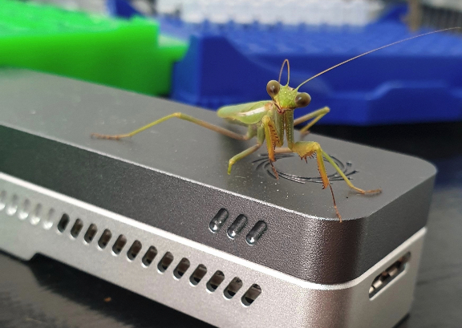

<!-- Main -->

	<!-- Content -->
	<section id="one">
		

			<header class="major">
				<h1>Open source software</h1>
			</header>
		

</section>

<section id="content" class="spotlights">
	

		

			

				
				
				
					

				
					

				
					<figure class="imghvr-reveal-right">
						<figcaption>
							<h3>{{ page.title }}</h3>
							
{{ page.description }}

						</figcaption>
						
					</figure>
					

				
			

		

	

	<section>
		<!--  -->
		

			

				<header class="major">
						<h1>Find out more</h1>
				</header>
				
All our software is accesible via the GitHub ARTIC group

				<ul class="actions">
					<li><a href="https://github.com/artic-network" class="button">visit GitHub</a></li>
				</ul>
			

		

	</section>
</section>

