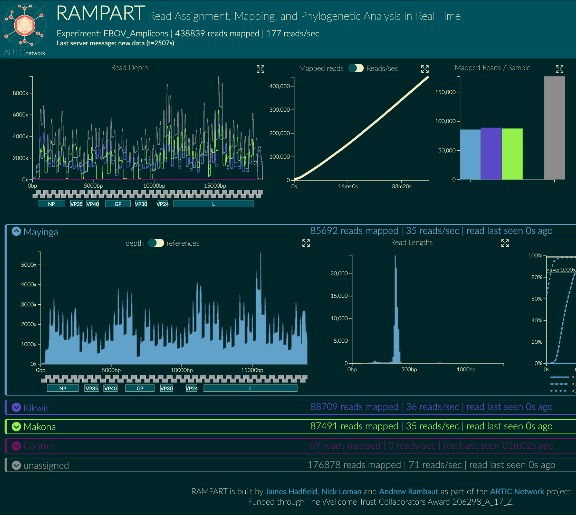

<!-- Main -->

	<!-- Content -->
	<section id="one">
		

			<header class="major">
				<h1>About</h1>
			</header>
			<!-- Intro -->
			<h2 id="content">The Project</h2>
			
This project is developing an end-to-end system for processing samples from viral outbreaks to generate real-time epidemiological information that is interpretable and actionable by public health bodies. Fast evolving RNA viruses (such as Ebola, MERS, SARS, influenza etc) continually accumulate changes in their genomes that can be used to reconstruct the epidemiological processes that drive the epidemic. Based around a recently developed, single-molecule portable sequencing instrument, the Oxford Nanopore Technology MinION, we are creating a ‘lab-in-a-suitcase’ that can be deployed to remote and resource-limited locations. Targeting a wide-range of emerging viral diseases, the sequencing generation will be closely linked to the analysis platform to integrate these data and associated epidemiological knowledge to reveal the processes of transmission, virus evolution and epidemiological linkage with extremely rapid turn-around. This real-time approach will provide actionable epidemiological insights within days of samples being taken from patients.

			

			<!-- Subpoints -->
			

				

					<!-- Bullets -->
					<h3>The Network</h3>
						<ul>
							<li>University of Edinburgh</li>
							<li>University of Birmingham</li>
							<li>University of Cambridge</li>
							<li>KU Leuven</li>
							<li>University of Oxford</li>
							<li>Fred Hutchinson Cancer Research Center</li>
							<li>University of California Los Angeles</li>
						</ul>
					<h3>The Viruses</h3>
						<ul>
							<li>Ebola virus</li>
							<li>Measles</li>
							<li>2019-nCoV</li>
						</ul>
				

				

					<!-- Images -->
					<h3>Images</h3>
					
					

						

							

							

							

							<!-- Break -->
							

							

							

							<!-- Break -->
							

							

							

						

					

				

			

		

	</section>

